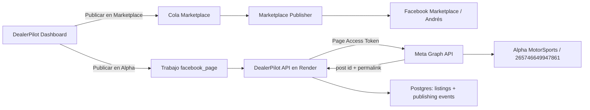

# DealerPilot: publicación de vehículos en Alpha MotorSports mediante Meta Pages API

**Fecha:** 22 de julio de 2026
**Estado:** informe y plan de implementación; no autoriza cambios de código, despliegues ni publicaciones reales.
**Página objetivo:** Alpha MotorSports
**Page ID identificado en Meta Business Suite:** `265746649947861`

## 1. Resumen ejecutivo

DealerPilot actualmente publica vehículos en Facebook Marketplace usando la sesión personal del vendedor Andrés Ibáñez y la extensión `DealerPilot AI Publisher`. Ese flujo está funcionando y debe conservarse.

El nuevo objetivo es permitir que el mismo inventario también se publique en la fanpage Alpha MotorSports, pero como una publicación de página independiente. La solución recomendada es usar Meta Pages API desde el backend de DealerPilot, no automatizar el compositor de Facebook con otra extensión salvo que Meta no conceda los permisos necesarios.

El Page ID `265746649947861` resuelve la identificación del destino, pero no concede autorización para publicar. Todavía se requiere:

1. Una aplicación en Meta for Developers administrada por una persona autorizada.
2. Acceso suficiente sobre Alpha MotorSports para crear contenido.
3. Los permisos de Meta necesarios para listar la página y administrar sus publicaciones.
4. Un Page Access Token generado mediante el flujo autorizado de Meta.
5. Cambios aditivos en DealerPilot para distinguir Marketplace de la fanpage.

La arquitectura final debe mantener dos rutas independientes:

```text
Marketplace -> extensión de Chrome -> perfil vendedor Andrés Ibáñez
Fanpage     -> backend de Render   -> Meta Pages API -> Alpha MotorSports
```

## 2. Objetivo

Agregar a DealerPilot la capacidad de publicar un vehículo en Alpha MotorSports con texto y fotografías, registrar el identificador y la URL devueltos por Meta, mostrar el resultado en el dashboard y evitar publicaciones duplicadas o realizadas en el destino incorrecto.

La nueva función debe cumplir estas condiciones:

- Marketplace continúa funcionando sin regresiones.
- La publicación en Alpha no depende de la sesión de Chrome del VPS.
- Andrés y Alpha se mantienen como destinos diferentes.
- El Page ID se valida contra la API antes de habilitar publicaciones.
- Los tokens y secretos nunca se almacenan en la extensión, el navegador o Git.
- La primera publicación requiere confirmación humana.
- Ante un resultado ambiguo, el sistema se detiene en `Needs Review` y no reintenta automáticamente.

## 3. Planteamiento del problema

### 3.1 Dos identidades y dos canales

Marketplace opera con el perfil vendedor Andrés Ibáñez. Alpha MotorSports es una página de negocio. Aunque ambas superficies puedan abrirse en un mismo Chrome, no representan la misma identidad ni deberían compartir una decisión de publicación.

La cola actual está orientada a Marketplace:

- La extensión abre directamente `https://www.facebook.com/marketplace/create/vehicle`.
- `GET /api/publishing/jobs/next` no recibe actualmente un canal.
- La finalización del trabajo registra `channel: "marketplace"` de forma fija.
- `publishing_jobs` no contiene todavía `channel` ni `targetPageId`.

Por tanto, reutilizar la cola sin distinguir destinos permitiría que la extensión de Marketplace reclamara por error un trabajo destinado a Alpha.

### 3.2 El Page ID no es un permiso

El valor `265746649947861` permite señalar exactamente la página, pero Meta solo aceptará una publicación si el token utilizado:

- pertenece a una aplicación válida;
- fue autorizado por una persona con acceso suficiente;
- incluye los permisos requeridos;
- produce un Page Access Token para esa página;
- sigue vigente y corresponde al Page ID esperado.

La prueba definitiva será una consulta de solo lectura a `/me/accounts?fields=id,name,tasks`. El resultado debe incluir simultáneamente:

```text
id = 265746649947861
name = Alpha MotorSports (o el nombre vigente de la página)
tasks incluye capacidad para crear contenido o control equivalente
```

Si el Page ID no aparece o no incluye capacidad de creación, no se debe intentar publicar.

### 3.3 Riesgo del DOM dinámico

Una extensión adicional podría abrir el compositor de Alpha y utilizar el Page ID como verificación. Sin embargo, los botones, diálogos y atributos de Facebook siguen siendo dinámicos. El ID reduce la posibilidad de elegir la página equivocada, pero no elimina los cambios del DOM.

Pages API elimina ese problema porque DealerPilot se comunica directamente con Meta desde Render. Por eso es el camino principal.

### 3.4 Seguridad y duplicados

Un Page Access Token permite actuar como la página y debe tratarse como una contraseña. No debe aparecer en:

- capturas de pantalla;
- mensajes de chat;
- archivos `.env` versionados;
- almacenamiento de Chrome;
- logs del servidor;
- respuestas del API hacia el dashboard.

Además, una respuesta incierta de Meta no debe ocasionar un reintento automático: si Meta crea la publicación pero la conexión se corta antes de recibir la respuesta, repetir el `POST` podría duplicarla.

## 4. Solución propuesta

## 4.1 Arquitectura



## 4.2 Contrato de destino

Cada trabajo deberá declarar su destino de forma explícita:

```json
{
  "channel": "facebook_page",
  "targetPageId": "265746649947861",
  "targetIdentity": "alpha_motorsports",
  "mode": "Assisted"
}
```

Los trabajos existentes conservarán estos valores por defecto:

```json
{
  "channel": "marketplace",
  "targetPageId": null,
  "targetIdentity": "andres_marketplace"
}
```

La compatibilidad debe ser retroactiva: una llamada antigua a `GET /publishing/jobs/next` debe seguir devolviendo exclusivamente trabajos de Marketplace. La extensión instalada no tendrá que conocer ni ignorar trabajos de fanpage.

## 4.3 Integración con Meta

La aplicación de Meta debe solicitar solamente los permisos necesarios para este objetivo:

- `pages_show_list`: localizar las páginas accesibles para el usuario autorizado.
- `pages_read_engagement`: leer la información necesaria de la página y validar resultados.
- `pages_manage_posts`: crear y administrar publicaciones de la página.

El flujo de preparación será:

1. Registrar al propietario o administrador autorizado en Meta for Developers.
2. Crear una aplicación para el negocio o reutilizar una aplicación válida.
3. Agregar el caso de uso de administración de páginas.
4. Vincular la aplicación con el portafolio empresarial cuando Meta lo solicite.
5. Agregar como administrador o desarrollador de la aplicación a la persona que realizará la configuración técnica.
6. Autorizar los permisos anteriores desde una cuenta con acceso a Alpha.
7. Obtener un User Access Token temporal mediante el flujo autorizado.
8. Consultar `/me/accounts?fields=id,name,access_token,tasks`.
9. Seleccionar únicamente la entrada cuyo `id` sea `265746649947861`.
10. Guardar su Page Access Token como secreto de Render.
11. Validar el token nuevamente desde el backend antes de habilitar la función.

El modo de la aplicación, la verificación comercial y una posible App Review dependerán de los roles reales que usen la app y de lo que Meta exija en su panel en ese momento. No se asumirá que la revisión es innecesaria: primero se hará la prueba con los roles autorizados y se documentará cualquier requisito mostrado por Meta.

## 4.4 Secretos de Render

DealerPilot ya reconoce varios nombres relacionados con Meta. La configuración mínima esperada será:

```text
META_PAGE_ID=265746649947861
META_PAGE_ACCESS_TOKEN=<secreto>
META_GRAPH_API_VERSION=<versión habilitada por la aplicación>
META_APP_ID=<identificador no secreto>
META_APP_SECRET=<secreto>
META_PAGE_PUBLISHING_ENABLED=false
```

`META_PAGE_PUBLISHING_ENABLED` comenzará en `false`. Solo se cambiará a `true` después de validar permisos, pruebas y modo asistido.

El backend debe redactar cualquier campo llamado `access_token`, `token`, `app_secret` o equivalente en logs y errores.

## 4.5 Publicación de fotografías

El servicio de fanpage deberá construir el texto con datos del mismo vehículo, pero usando una plantilla específica para el feed de Alpha. No debe asumir que el texto o precio de Marketplace es automáticamente apropiado para la fanpage.

La secuencia para varias fotografías será validada contra la versión de Graph API elegida, pero conceptualmente será:

1. Seleccionar y validar las fotografías del vehículo.
2. Cargar cada fotografía como media no publicada para la página.
3. Conservar los identificadores de media devueltos por Meta.
4. Crear una única publicación en el feed con el mensaje y los medios adjuntos.
5. Guardar el ID de publicación devuelto por Meta.
6. Consultar la publicación para obtener o verificar su enlace permanente.
7. Registrar `externalId`, `externalUrl`, fecha, Page ID y canal.

La primera prueba usará una sola fotografía. La prueba con múltiples fotografías se realizará después de comprobar el contrato básico.

## 4.6 Estados y manejo de errores

Estados sugeridos para trabajos de fanpage:

```text
Queued
Validating Meta Access
Preparing Media
Uploading Media
Ready for Review
Publishing
Published
Needs Review
Failed
Cancelled
```

Reglas críticas:

- `401/403`: detener; token o permisos inválidos. No reintentar automáticamente.
- Page ID diferente: detener con `target_identity_mismatch`.
- Falta de permiso para crear contenido: detener con `missing_create_content_access`.
- Fotografía inválida: fallar antes de publicar.
- Timeout antes de enviar el `POST`: reintento limitado permitido.
- Timeout durante o después del `POST`: `Needs Review`; no repetir hasta verificar manualmente.
- Respuesta sin ID de publicación: `Needs Review`.
- Trabajo ya publicado para el mismo vehículo y canal: rechazar como duplicado.

## 4.7 Cambios previstos en DealerPilot

Los cambios deben ser aditivos y de alcance estrecho.

### Base de datos

- `lib/db/src/schema/publishingJobs.ts`
  - agregar `channel` con valor por defecto `marketplace`;
  - agregar `targetPageId` nullable;
  - agregar `targetIdentity` nullable;
  - agregar índice por estado y canal.
- `lib/db/src/schema/listings.ts`
  - conservar la separación por `channel`;
  - registrar `facebook_page` para Alpha;
  - almacenar el post ID en `externalId` y el permalink en `externalUrl`.

### Backend

- Crear un cliente pequeño para Meta Graph API con timeout, redacción de secretos y errores tipados.
- Crear un servicio de publicación de página separado de `metaMessenger.ts`.
- Agregar una verificación de solo lectura para estado de conexión y permisos.
- Procesar únicamente trabajos `channel=facebook_page` en el ejecutor de fanpage.
- Mantener `GET /publishing/jobs/next` limitado a Marketplace para la extensión actual.
- Registrar eventos de cada fase sin incluir tokens.
- Añadir un interruptor de emergencia para detener publicaciones de página.

### Dashboard

- Mostrar Alpha MotorSports como destino separado.
- Agregar una acción explícita `Publicar en Alpha` sin cambiar la acción actual de Marketplace.
- Mostrar vista previa del texto y fotografías.
- Comenzar siempre en modo asistido.
- Mostrar estados de conexión: Page ID, permisos, token válido y función habilitada.
- Permitir cancelar antes de publicar.
- Mostrar el enlace de la publicación confirmada.

### Contratos y tipos

- Extender los esquemas compartidos para `channel`, `targetPageId` y estados de fanpage.
- Mantener valores por defecto compatibles con clientes actuales.
- No renombrar rutas ni campos que Marketplace ya consume.

## 5. Paso a paso completo

### Fase 0: autorización y acceso

Responsable principal: propietario de Alpha y usuario.

1. El propietario completa su registro de Meta for Developers si Meta lo exige.
2. El propietario confirma quién será administrador de la aplicación.
3. El propietario concede al usuario acceso suficiente a Alpha para crear contenido o control total, según la política interna del negocio.
4. Nadie comparte contraseñas, códigos SMS ni códigos de autenticación.
5. El usuario confirma que puede abrir Alpha desde su propia Business Suite.

**Salida:** una persona autorizada puede administrar la app y Alpha sin usar la identidad de otra persona.

### Fase 1: creación de la aplicación Meta

Responsable principal: usuario/propietario, con acompañamiento de Codex.

1. Abrir Meta for Developers desde la sesión autorizada.
2. Revisar si ya existe una aplicación apropiada.
3. Si no existe, crear una app para DealerPilot/Alpha.
4. Elegir el caso de uso relacionado con administración de páginas.
5. Asociar el portafolio empresarial correcto.
6. Registrar correo de contacto y demás datos requeridos.
7. No activar producción ni solicitar permisos adicionales innecesarios.

**Salida:** App ID visible y acceso administrativo confirmado.

### Fase 2: prueba de identidad y permisos

Responsable principal: usuario con acompañamiento de Codex.

1. Abrir Graph API Explorer o el mecanismo recomendado por el panel de la app.
2. Seleccionar la aplicación recién creada.
3. Solicitar `pages_show_list`, `pages_read_engagement` y `pages_manage_posts`.
4. Generar un User Access Token temporal.
5. Ejecutar:

```http
GET /me/accounts?fields=id,name,tasks
```

6. Confirmar que aparece `265746649947861` y una tarea de creación de contenido/control equivalente.
7. No pegar ni fotografiar el token.
8. Si Alpha no aparece, revisar acceso a la página y vinculación con el portafolio; no continuar.

**Salida:** evidencia de solo lectura de que la app puede identificar Alpha y que el usuario tiene la tarea correcta.

### Fase 3: preparación técnica de DealerPilot

Responsable principal: Codex, después de autorización expresa para modificar código.

1. Crear migración aditiva para canal y Page ID.
2. Añadir tipos y validaciones.
3. Implementar cliente Graph API.
4. Implementar verificación de conexión sin publicar.
5. Implementar servicio de medios y publicación.
6. Añadir el ejecutor separado para trabajos de fanpage.
7. Añadir acción y estado en el dashboard.
8. Crear pruebas unitarias, de contrato y regresión.
9. Mantener el interruptor de publicación apagado.

**Salida:** código listo para verificar sin realizar publicaciones reales.

### Fase 4: configuración segura en Render

Responsable principal: usuario/propietario para introducir secretos; Codex verifica nombres y estado sin revelar valores.

1. Configurar Page ID, versión Graph API, App ID, App Secret y Page Access Token.
2. Mantener `META_PAGE_PUBLISHING_ENABLED=false`.
3. Desplegar backend.
4. Consultar el diagnóstico de conexión.
5. Confirmar que el backend informa Alpha, Page ID correcto y permiso de publicación.
6. Revisar logs para confirmar que ningún token fue expuesto.

**Salida:** conexión de solo lectura saludable en producción.

### Fase 5: pruebas controladas

Responsable principal: Codex para pruebas técnicas; usuario para aprobar acciones visibles.

1. Ejecutar pruebas automáticas sin red.
2. Ejecutar regresiones de Marketplace.
3. Preparar una publicación de prueba con una fotografía.
4. Mostrar la vista previa al usuario.
5. Obtener autorización expresa para la publicación real.
6. Habilitar temporalmente el interruptor.
7. Publicar una sola vez.
8. Verificar post ID, permalink, autor Alpha, texto y fotografía.
9. Deshabilitar nuevamente el interruptor mientras se revisa el resultado.
10. La eliminación de una publicación de prueba será manual y solo con autorización.

**Salida:** una publicación real verificada sin afectar Marketplace.

### Fase 6: activación gradual

1. Probar múltiples fotografías.
2. Mantener confirmación humana durante las primeras publicaciones.
3. Medir errores, tiempos y duplicados.
4. Habilitar automatización únicamente cuando el flujo sea estable.
5. Conservar el interruptor de emergencia y el modo asistido.

## 6. Qué debe hacer el usuario

1. Coordinar con el propietario el registro y seguridad de Meta for Developers.
2. Conseguir acceso suficiente a Alpha para crear contenido.
3. Confirmar que la aplicación pertenece al negocio o tiene una administración duradera.
4. Realizar las aprobaciones de Meta desde su propia cuenta.
5. No compartir tokens, secretos, contraseñas ni códigos de seguridad.
6. Introducir los secretos directamente en Render cuando llegue el momento.
7. Elegir el vehículo y revisar la vista previa de la primera publicación.
8. Autorizar explícitamente cualquier publicación real, despliegue o activación automática.
9. Informar si Meta exige verificación empresarial o App Review.

El usuario sí puede compartir de forma segura:

- Page ID;
- App ID;
- nombres de permisos;
- mensajes de error sin tokens;
- capturas con credenciales ocultas.

## 7. Qué debe hacer Codex

1. Revisar el estado actual del repositorio antes de editar.
2. Proteger el flujo de Marketplace existente.
3. Presentar el alcance exacto y pedir autorización antes de cualquier cambio fuerte.
4. Diseñar la migración aditiva y reversible.
5. Implementar el cliente de Meta y el servicio de fanpage separados de Marketplace y Messenger.
6. Implementar validación estricta de Page ID y permisos.
7. Evitar que la extensión reclame trabajos `facebook_page`.
8. Implementar redacción de secretos y manejo seguro de errores.
9. Implementar modo asistido, vista previa, auditoría y protección contra duplicados.
10. Ejecutar pruebas técnicas y mostrar los resultados.
11. No publicar, desplegar, subir a GitHub ni activar automatización sin autorización.
12. Entregar instrucciones exactas para Render sin solicitar que el usuario revele secretos.

## 8. Pruebas y criterios de aceptación

Pruebas mínimas nuevas:

- Page ID correcto y permiso suficiente.
- Page ID distinto al configurado.
- Alpha ausente de `/me/accounts`.
- Token vencido o revocado.
- Falta de `pages_manage_posts`.
- Una fotografía válida.
- Varias fotografías.
- Error de carga antes de crear el post.
- Timeout ambiguo durante la creación.
- Rechazo de un duplicado.
- Redacción del token en logs.
- Trabajo Marketplace invisible para el ejecutor de fanpage.
- Trabajo fanpage invisible para la extensión Marketplace.

Regresiones obligatorias:

```powershell
npm.cmd run lint:extension
npm.cmd run test:extension:marketplace
npm.cmd run test:publishing-flow
```

Criterios para considerar el objetivo cumplido:

1. `/me/accounts` valida Alpha y el Page ID esperado.
2. El token permanece únicamente en secretos de Render.
3. Marketplace conserva sus pruebas y comportamiento.
4. La primera publicación muestra a Alpha como autor.
5. Texto y fotografías coinciden con la vista previa aprobada.
6. DealerPilot almacena post ID y permalink.
7. Un reintento no produce una segunda publicación.
8. El interruptor detiene inmediatamente nuevas publicaciones de página.

## 9. Reversión

La reversión debe ser sencilla:

1. Configurar `META_PAGE_PUBLISHING_ENABLED=false`.
2. Cancelar trabajos `facebook_page` pendientes.
3. Mantener intactos los trabajos y registros `marketplace`.
4. Retirar o rotar el Page Access Token en Meta/Render si es necesario.
5. Ocultar temporalmente la acción `Publicar en Alpha`.
6. No revertir datos ni código de Marketplace.


## 11. Mega prompt de implementación

El siguiente prompt debe utilizarse únicamente cuando el propietario haya completado la preparación de Meta y el usuario autorice expresamente la implementación:

```text
Trabaja en C:\dev\dealerpilot.

OBJETIVO
Implementa un canal independiente para publicar vehículos en la fanpage Alpha MotorSports mediante Meta Pages API. El Page ID esperado es 265746649947861. Marketplace ya funciona con la extensión Chrome bajo el perfil vendedor Andrés Ibáñez y no debe sufrir regresiones.

REGLA PRINCIPAL
"Lo que funciona no se toca". Haz cambios aditivos, estrechos y reversibles. No reestructures chrome-extension/, publisherFlow.js, queueClient.js ni el flujo de Marketplace por limpieza. No cambies endpoints o respuestas existentes salvo que sea estrictamente necesario y compatible.

ANTES DE EDITAR
1. Revisa git status y conserva cambios ajenos.
2. Mapea publishingJobs, listings, publishing.ts, worker, PublishNowModal, contratos y pruebas existentes.
3. Verifica los nombres META_* ya usados por el backend.
4. Presenta evidencia y pide autorización específica antes de cualquier cambio fuerte.

CONTRATO
Agrega a publishing_jobs:
- channel, default "marketplace";
- targetPageId nullable;
- targetIdentity nullable.

Los clientes antiguos y GET /api/publishing/jobs/next deben continuar recibiendo exclusivamente Marketplace por defecto. Un trabajo facebook_page jamás puede ser reclamado por DealerPilot AI Publisher.

DESTINO FANPAGE
channel = "facebook_page"
targetPageId = "265746649947861"
targetIdentity = "alpha_motorsports"

META
Usa únicamente secretos del servidor:
- META_PAGE_ID
- META_PAGE_ACCESS_TOKEN
- META_GRAPH_API_VERSION
- META_APP_ID
- META_APP_SECRET
- META_PAGE_PUBLISHING_ENABLED

Nunca envíes tokens al dashboard, extensión o logs. Implementa redacción de secretos.

Implementa una verificación de solo lectura basada en /me/accounts o el endpoint vigente equivalente. Debe comprobar Page ID, nombre y tarea/capacidad para crear contenido. Si el Page ID no coincide, falla cerrado.

BACKEND
1. Crea un cliente Graph API pequeño con timeout, errores tipados y respuestas validadas.
2. Crea un servicio de Page publishing independiente de metaMessenger.ts.
3. Implementa publicación con una fotografía y luego múltiples fotografías usando el contrato vigente de la Graph API seleccionada.
4. Guarda post ID en listings.externalId, permalink en externalUrl y channel=facebook_page.
5. Implementa estados, eventos y Needs Review para resultados ambiguos.
6. No reintentes automáticamente un POST cuya ejecución pudo llegar a Meta.
7. Implementa protección contra duplicados y un interruptor de emergencia.

DASHBOARD
1. Mantén intacta la acción de Marketplace.
2. Agrega una acción explícita "Publicar en Alpha".
3. Muestra vista previa, fotografías, estado de Meta y resultado.
4. Usa modo Assisted inicialmente y exige confirmación antes del primer post.

PRUEBAS
Agrega pruebas para permisos, Page ID incorrecto, token inválido, una/múltiples fotos, timeout ambiguo, duplicados, separación de colas y redacción de secretos.

Ejecuta obligatoriamente:
npm.cmd run lint:extension
npm.cmd run test:extension:marketplace
npm.cmd run test:publishing-flow
y todas las pruebas nuevas del backend/dashboard.

SEGURIDAD OPERATIVA
No hagas llamadas reales de publicación durante pruebas automáticas. No publiques físicamente, no despliegues, no modifiques secretos de Render, no hagas commit y no subas a GitHub sin autorización expresa. Para una prueba real, detente antes del POST final, muestra la vista previa y solicita aprobación.

ENTREGA
Informa archivos cambiados, migraciones, contratos, pruebas ejecutadas, riesgos pendientes, instrucciones exactas de Render y procedimiento de reversión. Separa con claridad lo validado de lo asumido.
```

## 12. Conclusión

El Page ID `265746649947861` permite identificar de manera estable a Alpha MotorSports, pero el siguiente hito no es escribir código: es demostrar que una aplicación autorizada puede devolver esa página mediante Meta Graph API y que la cuenta autorizante posee capacidad para crear contenido.

Si esa prueba resulta positiva, Pages API es la solución más segura: elimina el DOM dinámico, no depende del VPS, no obliga a cambiar entre Andrés y Alpha en Chrome y permite registrar cada publicación con su identificador real.

La implementación debe ser aditiva: Marketplace seguirá siendo el canal predeterminado y Alpha será un canal separado, inicialmente asistido, protegido por validación de identidad, secretos de servidor, prevención de duplicados y un interruptor de emergencia.

## 13. Referencias

- [Meta Pages API: publicaciones](https://developers.facebook.com/docs/pages-api/posts/)
- [Meta: access tokens](https://developers.facebook.com/docs/facebook-login/guides/access-tokens/)
- [Colección oficial de Meta en Postman: obtener páginas administradas](https://www.postman.com/meta/facebook/request/bqfxwbp/get-access-tokens-of-pages-you-manage)
- [Facebook Help: crear publicaciones para una página](https://www.facebook.com/help/www/181155025579876)
