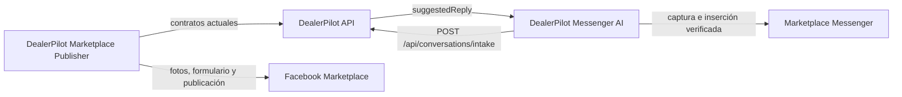

# DealerPilot: separación mínima de Marketplace Publisher y Messenger AI

**Estado:** plan para una implementación futura.  
**Base que debe preservarse:** extensión DealerPilot v1.3.86.  
**Regla principal:** **lo que funciona no se toca**.

> Este documento no autoriza todavía cambios de código, mensajes reales, publicaciones físicas, despliegues ni envíos a GitHub.

## 1. Decisión ejecutiva

DealerPilot tendrá dos extensiones de Chrome:

| Extensión | Responsabilidad |
|---|---|
| **DealerPilot Marketplace Publisher** | Conserva exactamente el flujo actual de publicación: cola, fotos, formulario, validaciones, intervalos y resultado final. |
| **DealerPilot Messenger AI** | Detecta conversaciones, captura el mensaje del comprador, consulta la IA, inserta la respuesta y verifica el envío. |

La separación se hará con el menor cambio posible:

1. La extensión principal no se reestructura ni se reescribe.
2. Primero se crea Messenger AI de manera independiente.
3. La nueva extensión reutiliza los contratos de conversaciones existentes.
4. Se prueba inicialmente sin enviar mensajes.
5. Solo cuando esté validada se apaga el Messenger anterior mediante un interruptor reversible.
6. El único cambio visible adicional de la principal será su nombre: `DealerPilot Marketplace Publisher`.

No se cambiarán el backend, la base de datos, los workers ni la asignación de trabajos de publicación.

## 2. Regla de oro: lo que funciona no se toca

Esta regla se convierte en una condición técnica verificable:

- No mover código estable de publicación entre archivos.
- No renombrar la carpeta `chrome-extension/`.
- No reescribir `publisherFlow.js` para “ordenarlo”.
- No cambiar rutas, payloads ni respuestas del backend.
- No cambiar la lógica de fotos, la cola ni los intervalos.
- No cambiar workers, orquestador ni asignación de jobs.
- No cambiar `extension_connections` ni `/api/extension/heartbeat`.
- No cambiar el Connection Center.
- No eliminar inicialmente el código antiguo de Messenger.
- No hacer mejoras laterales innecesarias.

La estrategia será **agregar primero y cambiar al final**. El sistema actual seguirá siendo la referencia de comportamiento y el mecanismo de reversión.

## 3. Planteamiento del problema

La extensión actual publica vehículos y también monitorea conversaciones de Marketplace. Ambas funciones están parcialmente mezcladas en el mismo runtime. Esto aumenta el riesgo de que un cambio futuro del DOM de Messenger obligue a reemplazar una extensión que ya publica correctamente.

El problema no es que el Publisher esté fallando. Precisamente porque ya funciona, debe protegerse de cambios innecesarios. La separación busca aislar las futuras modificaciones de Messenger sin alterar el flujo estable de publicación.

## 4. Evidencia del sistema actual

El repositorio ya contiene piezas reutilizables:

- `chrome-extension/src/content/facebook/messengerCapture.js` contiene captura específica de conversaciones.
- `chrome-extension/src/content/facebook/publisherFlow.js` contiene la publicación y una sección de Messenger.
- `chrome-extension/src/background/queueClient.js` contiene handlers de publicación y conversaciones.
- El contrato activo es `POST /api/conversations/intake`.
- El backend ya responde con `suggestedReply` y conserva sus validaciones y deduplicación.
- Los diagnósticos actuales distinguen estados como `buyer_message_missing`, conversación no activa, superficie incorrecta y ausencia del composer.

La nueva extensión puede reproducir este comportamiento sin rediseñar la plataforma.

## 5. Solución mínima

### 5.1 Extensión principal

La carpeta seguirá siendo `chrome-extension/`. Conservará sin modificación funcional:

- conexión y cola de publicación;
- reclamación de trabajos;
- obtención y carga de fotos;
- llenado y validación del formulario;
- botones Next y Publish;
- URL final y estados del job;
- intervalos entre publicaciones;
- diagnósticos de Marketplace.

Cuando Messenger AI esté probado, la principal recibirá únicamente:

1. Cambio de nombre visible a `DealerPilot Marketplace Publisher`.
2. Un interruptor reversible que impida iniciar su automatización antigua de Messenger.
3. La desactivación de la apertura automática del Inbox cuando ese interruptor esté apagado.

El código antiguo de Messenger quedará temporalmente dormido. No se eliminará ni se hará una gran extracción durante esta migración.

### 5.2 Nueva extensión

Se creará en `chrome-extension-messenger/` con el nombre `DealerPilot Messenger AI`. Tendrá manifest, service worker, content scripts, popup, storage, configuración, diagnósticos e ID de Chrome propios.

Su única responsabilidad será:

- detectar una conversación activa de Marketplace;
- confirmar que corresponde al vendedor;
- identificar el último mensaje entrante del comprador;
- evitar capturar respuestas propias;
- respetar la ventana de silencio actual;
- construir el mismo payload actual;
- llamar `POST /api/conversations/intake`;
- recibir `suggestedReply`;
- insertar la respuesta en el composer;
- enviar solo cuando esté expresamente habilitado;
- verificar que la respuesta apareció como enviada;
- exponer diagnósticos claros.

No contendrá cola de publicación, endpoints `/api/publishing/jobs/*`, fotos, formulario de vehículos, Next, Publish ni temporizadores de publicación.

## 6. Arquitectura resultante



No se introduce un heartbeat nuevo, rol de extensión, migración de base de datos o lease backend. La primera versión de Messenger AI mostrará su estado en su propio popup.

## 7. Cambios estrictamente permitidos

### 7.1 En la principal, después de validar la nueva

- Cambiar nombre y descripción visibles en `chrome-extension/manifest.json`.
- Añadir o reutilizar una bandera booleana de activación de Messenger.
- Evitar iniciar monitor, listeners u observadores de Messenger cuando esté apagada.
- Evitar abrir automáticamente el Inbox desde la principal.
- Conservar intacto todo el código de Marketplace Publisher.

La implementación debe localizar los puntos de entrada y apagarlos. No debe envolver ni modificar todo `publisherFlow.js`.

Ejemplo conceptual, no implementación definitiva:

```js
const MESSENGER_AI_ENABLED = false;

if (MESSENGER_AI_ENABLED) {
  startMessengerAutomation();
}
```

### 7.2 En la nueva extensión

Se copiará o adaptará solamente lo necesario para Messenger:

- captura y selección de conversación;
- validación del mensaje del comprador;
- diagnósticos;
- llamada a `conversations/intake`;
- inserción y verificación en el composer;
- protección contra respuestas propias y duplicadas;
- configuración `dryRun` y `autoReplyEnabled`.

Los utilitarios mínimos se copiarán dentro de la nueva raíz. No habrá enlaces simbólicos ni imports entre raíces: cada paquete debe funcionar independientemente.

### 7.3 Fuera de alcance

- migraciones SQL;
- campos `extensionRole` o `capabilities`;
- heartbeats separados;
- leases de conversaciones;
- cambios de workers u orquestador;
- cambios de rutas, payloads o asignación de jobs;
- rediseño del dashboard;
- refactor general de archivos grandes;
- eliminación física del Messenger antiguo;
- cambios de estilo o funciones de IA no indispensables.

## 8. Plan paso a paso

### Fase 0: congelar la referencia

1. Conservar el ZIP v1.3.86, su commit y pruebas.
2. No modificar todavía la principal.
3. Documentar puntos de entrada de Messenger y el payload real de `/api/conversations/intake`.

### Fase 1: crear el esqueleto independiente

1. Crear `chrome-extension-messenger/`.
2. Añadir manifest, service worker, popup e iconos.
3. Darle storage y configuración propios.
4. Usar por defecto:

```text
dryRun = true
autoReplyEnabled = false
```

5. Restringir sus permisos a Facebook y la API necesarios.
6. No tocar `chrome-extension/`.

### Fase 2: trasladar observación y diagnósticos

1. Copiar/adaptar `messengerCapture.js`.
2. Migrar detección de conversación y superficie de vendedor.
3. Migrar detección del último mensaje entrante y protecciones contra mensajes propios.
4. Mostrar el motivo exacto cuando no haya captura.

El resultado debe reconocer mensajes sin llamar a la IA ni escribir en el composer.

### Fase 3: conectar la IA existente

1. Construir el mismo payload actual.
2. Reutilizar `POST /api/conversations/intake` sin cambiarlo.
3. Conservar `idempotencyKey`, `messageHash` y `externalThreadRef` usados actualmente.
4. Recibir y registrar `suggestedReply`.
5. Mantener `autoReplyEnabled = false`.

### Fase 4: trasladar composer y verificación

1. Migrar localización e inserción en el composer.
2. Migrar verificación de inserción y entrega.
3. Mantener el envío bloqueado por defecto.
4. Simular composer ausente, inserción fallida, envío fallido y confirmado.

### Fase 5: validar la nueva aisladamente

1. Ejecutar pruebas de contrato y DOM simulado.
2. Confirmar que no llama endpoints de publicación ni contiene fotos o formulario.
3. Cargarla como unpacked con la principal todavía intacta.
4. Usarla únicamente en `dryRun` para observar una conversación real.

### Fase 6: cambio mínimo en Publisher

Solo comienza cuando lo anterior pase:

1. Cambiar el nombre visible.
2. Apagar el punto de entrada de Messenger con la bandera reversible.
3. Impedir que Publisher abra el Inbox.
4. No borrar el código anterior.
5. Ejecutar toda la regresión.
6. Revisar que el diff no toque fotos, formularios, cola ni publicación.

### Fase 7: convivencia controlada

1. Cargar ambas carpetas con `Load unpacked`.
2. Confirmar nombres e IDs diferentes.
3. Confirmar que cada popup muestra solo su dominio.
4. Mantener `dryRun = true` y `autoReplyEnabled = false`.
5. Autorizar por separado cualquier envío real.

### Fase 8: empaquetado

Solo si todas las pruebas pasan:

1. Generar dos ZIP runtime-only.
2. Validar manifests y archivos referenciados.
3. Informar versiones, tamaños y SHA-256.
4. Hacer commit o push solo con autorización explícita.

## 9. Pruebas obligatorias

### 9.1 Regresión del Publisher

```powershell
npm.cmd run test:extension:marketplace
npm.cmd run test:publishing-flow
npm.cmd run test:qa:final
npm.cmd run lint:extension
git diff --check
```

El diff debe demostrar que no cambió fotos, formulario, Next, Publish, intervalo o resultados de jobs.

### 9.2 Pruebas nuevas de Messenger

```powershell
npm.cmd run test:extension:messenger
npm.cmd run test:extension:messenger:e2e
npm.cmd run test:extensions:isolation
```

Casos mínimos:

1. Sin mensaje del comprador: `buyer_message_missing` y ninguna llamada a IA.
2. Mensaje válido: captura única.
3. Mensaje propio: no se captura como comprador.
4. Repetición: bloqueada por deduplicación.
5. Composer ausente o inserción no confirmada: no envía.
6. `dryRun = true`: nunca escribe ni envía.
7. `autoReplyEnabled = false`: genera sugerencia pero no envía.
8. Error backend: diagnóstico seguro.
9. Publisher no toca conversaciones.
10. Messenger AI no toca publicación.

Las pruebas técnicas no autorizan mensajes, publicaciones, despliegues ni GitHub reales.

## 10. Criterios de aceptación

- Toda la regresión actual de Publisher queda verde.
- Backend, base de datos y contratos de publicación no cambian.
- Messenger AI funciona en carpeta y runtime independientes.
- Comienza en modo seguro.
- Solo una extensión inicia la automatización de Messenger.
- El código anterior queda disponible para reversión.
- Los ZIP contienen solo runtime y tienen checksums documentados.

## 11. Reversión

1. Deshabilitar o retirar Messenger AI.
2. Volver a habilitar el interruptor anterior de Messenger, si fuera necesario.
3. O recargar directamente v1.3.86.
4. Confirmar nuevamente las pruebas de Publisher.

No requiere rollback de base de datos o servidor porque ninguno se modifica.

## 12. Riesgos y controles

| Riesgo | Control mínimo |
|---|---|
| Dos extensiones responden | No habilitar envío nuevo hasta apagar el punto de entrada anterior. |
| Se rompe publicación | No tocar su lógica y ejecutar regresión completa. |
| Messenger llama endpoints incorrectos | Prueba de aislamiento. |
| Se envía durante desarrollo | `dryRun=true` y `autoReplyEnabled=false`. |
| Reversión difícil | Conservar código anterior y ZIP v1.3.86. |
| Crece el alcance | Rechazar backend, esquema, workers y refactors innecesarios. |

## 13. Protocolo obligatorio para cambios fuertes

Un **cambio fuerte** es cualquier modificación que se salga de la extracción mínima aprobada o que pueda afectar componentes que hoy funcionan. Incluye, entre otros:

- backend o contratos HTTP existentes;
- esquema o datos de la base de datos;
- heartbeat, `extension_connections` o identidad de agentes;
- workers, orquestador o asignación de jobs;
- fotos, formulario, Next, Publish o intervalos;
- eliminación o refactor amplio del código anterior;
- comportamiento real de envío automático;
- despliegues, publicaciones físicas o cambios difíciles de revertir.

Encontrar que uno de estos cambios podría ser útil **no constituye autorización**. El bot debe detener la implementación antes de editar el componente afectado y presentar evidencia concreta.

### 13.1 Explicación obligatoria antes de pedir autorización

La solicitud deberá contener:

1. **Problema observado:** qué está fallando o qué requisito no puede cumplirse.
2. **Evidencia:** archivo, función, endpoint, log o prueba que demuestra el problema.
3. **Por qué el alcance mínimo no basta:** qué alternativas no invasivas se revisaron y por qué no resuelven el caso.
4. **Cambio fuerte propuesto:** archivos y componentes exactos que se tocarían.
5. **Comparación de resultados:** qué seguirá ocurriendo si no se hace y qué se espera corregir si se autoriza.
6. **Riesgo de aplicarlo:** qué funcionalidad existente podría verse afectada.
7. **Validación y reversión:** pruebas que se ejecutarán y forma exacta de volver atrás.
8. **Pregunta explícita de autorización:** el bot debe esperar una respuesta afirmativa antes de continuar.

No son suficientes explicaciones vagas como “es mejor arquitectura”, “sería más limpio” o “puede prevenir problemas”. Debe existir una necesidad demostrable relacionada con el objetivo.

### 13.2 Comparación obligatoria

El bot deberá mostrar una tabla con esta forma:

| Decisión | Consecuencia comprobada o esperada |
|---|---|
| **Si NO se aplica el cambio fuerte** | Explicar el problema concreto que seguirá ocurriendo, su frecuencia o condición de aparición y si existe una solución temporal. |
| **Si SÍ se aplica el cambio fuerte** | Explicar exactamente qué causa se elimina, qué comportamiento cambiará y qué riesgo nuevo se introduce. |

La comparación no debe prometer que “ya no habrá ningún problema” si las pruebas no pueden demostrarlo. Debe diferenciar entre:

- resultado confirmado por una prueba;
- resultado esperado por el análisis;
- riesgo externo que sigue dependiendo de Facebook, Chrome, red o cuenta.

### 13.3 Formato de la solicitud

```text
CAMBIO FUERTE DETECTADO — IMPLEMENTACIÓN DETENIDA

Problema:
[Descripción concreta]

Evidencia:
[Archivo, función, endpoint, log o prueba]

Por qué no basta una solución mínima:
[Alternativas pequeñas revisadas y resultado]

Cambio propuesto:
[Archivos, componentes y comportamiento exactos]

Comparación:
- Si NO se aplica: [problema que continuará y solución temporal, si existe].
- Si SÍ se aplica: [problema que se espera eliminar y riesgo introducido].

Pruebas y reversión:
[Validaciones y procedimiento para volver atrás]

¿Autorizas específicamente este cambio fuerte? No modificaré ese componente hasta recibir tu confirmación.
```

### 13.4 Regla de espera

Mientras no exista autorización explícita:

- no editar el componente afectado;
- no preparar silenciosamente el cambio dentro de otro archivo;
- no hacer commit, push o deploy;
- conservar cualquier avance seguro que no dependa del cambio;
- detenerse si no existe otra tarea segura dentro del alcance aprobado.

Una autorización para crear Messenger AI no equivale a autorizar backend, base de datos, workers o publicación. Cada cambio fuerte nuevo requiere su propia explicación y aprobación.

## 14. Mega prompt para la implementación futura

```text
Estamos trabajando en C:\dev\dealerpilot.

Lee completamente:
C:\dev\dealerpilot\docs\plan-arquitectura-dos-extensiones-dealerpilot.md

OBJETIVO

Crear "DealerPilot Messenger AI" y dejar la extensión actual dedicada a Marketplace Publisher, aplicando la regla: LO QUE FUNCIONA NO SE TOCA.

PRINCIPIO

Esta es una extracción aditiva, mínima y reversible, no un refactor general. Primero agrega y prueba la nueva extensión. Solo al final haz dos cambios mínimos en la principal: nombre visible e interruptor reversible de Messenger.

ALCANCE

1. Conserva la principal en chrome-extension/.
2. Crea la nueva en chrome-extension-messenger/.
3. La nueva se limita a captura de conversaciones, validación del comprador, deduplicación, ventana de silencio, POST /api/conversations/intake, suggestedReply, composer, verificación y diagnósticos.
4. Debe iniciar con dryRun=true y autoReplyEnabled=false.
5. Reutiliza el contrato existente; no cambies el backend.
6. Copia o adapta solo módulos mínimos. No uses symlinks ni imports entre las raíces.
7. Solo después de validar la nueva:
   - cambia el nombre visible de la principal a DealerPilot Marketplace Publisher;
   - apaga su punto de entrada Messenger con una bandera reversible;
   - evita que abra el Inbox;
   - deja su código Messenger dormido, sin borrarlo.

PROHIBICIONES

- No modificar backend, esquema, heartbeat o extension_connections.
- No añadir extensionRole, capabilities o leases.
- No modificar workers, orquestador o asignación de jobs.
- No modificar rutas o payloads de publicación.
- No modificar fotos, proxy, formulario, Next, Publish o temporizadores.
- No renombrar chrome-extension/.
- No reescribir publisherFlow.js para ordenarlo.
- No eliminar inicialmente el Messenger anterior.
- No rediseñar dashboard o Connection Center.
- No hacer limpiezas ajenas al objetivo.
- No enviar mensajes ni publicar vehículos sin permiso explícito.
- No hacer deploy, commit o push sin permiso explícito.

PROTOCOLO OBLIGATORIO PARA CAMBIOS FUERTES

Si durante el trabajo consideras necesario modificar backend, base de datos, heartbeat, extension_connections, workers, orquestador, asignación de jobs, rutas de publicación, fotos, formulario, Next, Publish, intervalos o eliminar/refactorizar ampliamente código estable:

1. DETENTE antes de editar ese componente.
2. No interpretes la necesidad técnica como autorización.
3. Presenta evidencia concreta: archivo, función, endpoint, log o prueba.
4. Explica por qué la solución mínima ya aprobada no basta y qué alternativas menos invasivas revisaste.
5. Identifica los archivos y comportamientos exactos que cambiarían.
6. Haz esta comparación obligatoria:
   - Si NO se aplica el cambio: qué problema concreto seguirá ocurriendo, bajo qué condición y qué solución temporal existe.
   - Si SÍ se aplica el cambio: qué causa se espera eliminar, qué resultado está confirmado o solo esperado y qué riesgo nuevo aparece.
7. Explica las pruebas y el procedimiento de reversión.
8. Pregunta: "¿Autorizas específicamente este cambio fuerte?"
9. Espera una respuesta afirmativa. Mientras tanto, no modifiques ese componente, ni hagas commit, push o deploy del cambio.

No justifiques un cambio fuerte solo porque sea más limpio o elegante. Debe ser estrictamente necesario y estar demostrado. Cada cambio fuerte diferente requiere autorización independiente.

MÉTODO

1. Registra estado Git, versión, puntos de entrada de Messenger, handlers, contrato real de intake y pruebas de referencia.
2. Ejecuta las pruebas actuales antes de editar.
3. Crea chrome-extension-messenger/ sin tocar todavía la principal.
4. Implementa por capas: esqueleto; captura; intake; composer; envío controlado apagado por defecto.
5. Prueba buyer_message_missing, mensaje válido, mensaje propio, deduplicación, conversación incorrecta, composer ausente, inserción/envío fallidos, dry-run y aislamiento.
6. Solo entonces aplica nombre e interruptor en Publisher.
7. Ejecuta:
   npm.cmd run test:extension:marketplace
   npm.cmd run test:publishing-flow
   npm.cmd run test:qa:final
   npm.cmd run lint:extension
   npm.cmd run test:extension:messenger
   npm.cmd run test:extension:messenger:e2e
   npm.cmd run test:extensions:isolation
   git diff --check
8. Confirma que no cambió fotos, formulario, cola, intervalos, workers, publicación o backend.
9. No hagas pruebas físicas de envío sin autorización; la primera prueba real será solo lectura en dry-run.
10. Solo con pruebas verdes y autorización genera dos ZIP runtime-only.

ENTREGA

- archivos creados y modificados;
- los dos cambios mínimos de Publisher;
- pruebas y resultados;
- evidencia de backend intacto y aislamiento;
- versiones, tamaños y SHA-256 de ZIPs;
- pasos para Load unpacked y reversión a v1.3.86;
- riesgos o pruebas físicas pendientes.

CONDICIÓN DE PARADA

Si parece necesario cambiar backend, base de datos, workers, publicación, fotos o contratos existentes, aplica el protocolo de cambios fuertes: detente, presenta evidencia, compara las consecuencias de hacerlo y no hacerlo, explica riesgos y reversión, y solicita autorización específica. No continúes hasta recibirla.
```

## 15. Conclusión

La segunda extensión es viable sin rediseñar DealerPilot. La prioridad no es conseguir la arquitectura más elegante en una sola intervención, sino conservar intacto lo que ya funciona: construir Messenger AI al lado, comprobarlo en modo seguro y cambiar el control únicamente al final.
